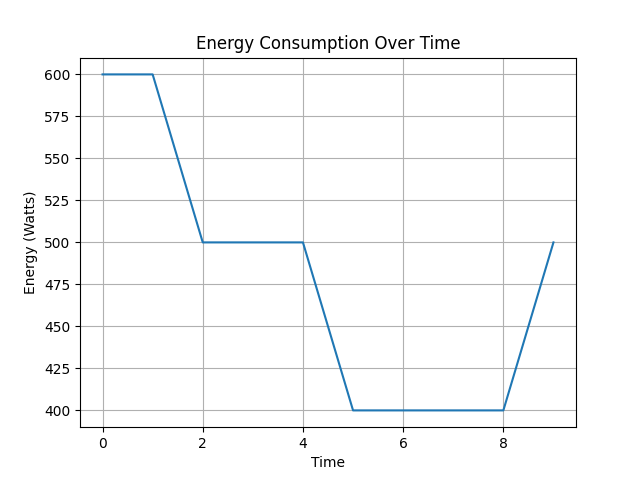

# Energy-Aware Cloud Management

##  Project Overview

This project simulates an energy-efficient cloud system that dynamically allocates resources based on CPU utilization.

##  Features

* VM consolidation
* Dynamic server scaling
* Energy consumption tracking
* Graph generation
* Docker containerization

##  Working

The system classifies servers into:

* UNDERLOADED
* NORMAL
* OVERLOADED

Based on CPU usage:

* Low → shutdown servers
* High → start new servers

##  Output

The system generates an energy consumption graph showing:
- Reduction in energy during low load
- Increase during high load

Example:

##  Docker Usage

Build:
docker build -t energy-cloud-sim .

Run:
docker run -v ${PWD}:/app energy-cloud-sim

##  Run Locally

pip install -r requirements.txt
python app.py

##  References

Beloglazov & Buyya – Energy Efficient VM Allocation
